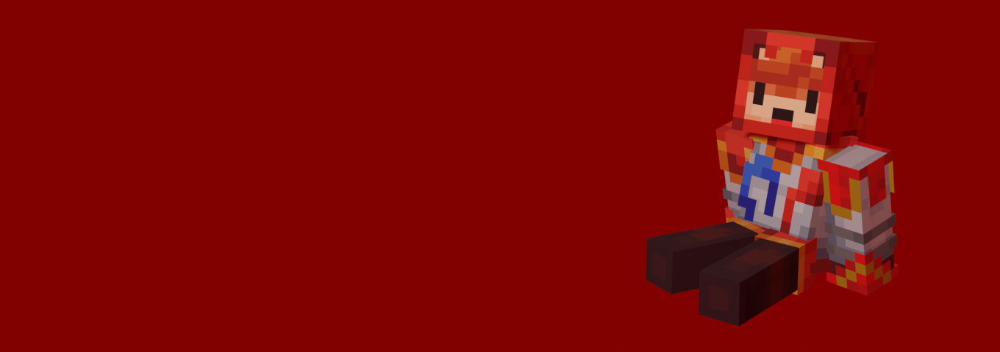

# Ludovic Morin (Abstra208)

## Introduction
**Salut, je m'appelle Ludovic et je suis un jeune Québécois passionné par la technologie.** 
Je n'ai que 15 ans, mais ne laissez pas mon âge vous aveugler. Je connais plus de choses que certaines personnes.
## Mes connaissances
**Depuis 2020, j'ai appris plusieurs langages de programmation ainsi que l'utilisation de logiciels de montage et de design graphique.**
### Les langages de programmation que je connais parfaitement :
- JavaScript
- HTML
- CSS
- Lua
- Python
### Les langages que je continue d'apprendre :
- C++
- Java
## Mes projets
### Je travaille actuellement sur quelques projets :
- [About Nothing (1)](https://github.com/abstra208/About-Nothing-1) 
About Nothing est un petit site web que j'ai construit comme projet scolaire pour prouver mon niveau d'apprentissage supérieur aux autres. 
Il ne montre qu'un petit aperçu des produits proposés par la marque Nothing™.
- [Phat Pi](https://github.com/abstra208/phat-pi) 
Phat Pi est un autre projet scolaire que je continue de développer pour apprendre le Python et le backend. 
Il permet de contrôler un écran LED appelé Scroll Phat HD. J'aimerais plus tard l'agrandir à n'importe quel écran LED.
## Communication
### Vous pouvez toujours m'envoyer un message à mon email : 
**LudovicMorin357@hotmail.com** 
### Toute contribution ou aide m'est très utile. Créer une pull request et la merger ou me faire un don sont toujours les bienvenus ! 

## Information diverse
- Ma couleur favorite est le [#0967a5](https://colors.dopely.top/color-pedia/0967a5)🔵. 
- Je fais du montage vidéo pour la chaîne YouTube intitulée [Astrobolt](https://www.youtube.com/@Astrobolt7281). 
- Tous les logos de mes projets sont créés par moi. 
